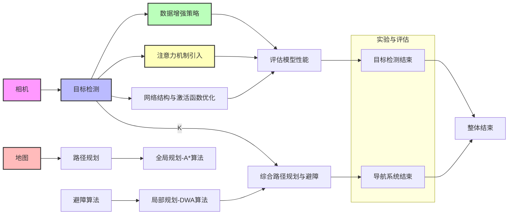

```mermaid
graph LR
    style A fill:#f9f,stroke:#333,stroke-width:2px
    style B fill:#bbf,stroke:#333,stroke-width:2px
    style C fill:#fbb,stroke:#333,stroke-width:2px
    style D fill:#bfb,stroke:#333,stroke-width:2px
    style E fill:#ffb,stroke:#333,stroke-width:2px

    A[相机] --> B[目标检测]
    C[地图]
    
    B --> D[数据增强策略]
    B --> E[注意力机制引入]
    B --> F[网络结构与激活函数优化]
    D --> G[评估模型性能]
    E --> G
    F --> G
    G --> H[目标检测结束]
    
    C --> I[路径规划]

    I --> K[全局规划-A*算法]
    J[避障算法] --> L[局部规划-DWA算法]
    B --
    K --> M[综合路径规划与避障]
    L --> M
    M --> N[导航系统结束]
    
    H --> O[整体结束]
    N --> O

    subgraph 实验与评估
        H
        N
    end

```