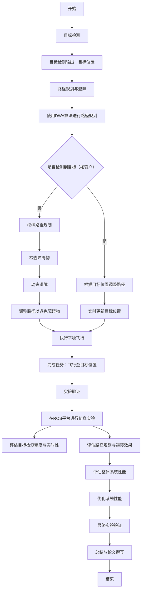

```mermaid
graph TD
    A[开始] --> B[目标检测]
    B --> C[目标检测输出：目标位置]
    C --> D[路径规划与避障]
    D --> E[使用DWA算法进行路径规划]
    E --> F{是否检测到目标（如窗户）}
    F -->|是| G[根据目标位置调整路径]
    F -->|否| H[继续路径规划]
    G --> I[实时更新目标位置]
    H --> J[检查障碍物]
    J --> K[动态避障]
    K --> L[调整路径以避免障碍物]
    L --> M[执行平稳飞行]
    I --> M
    M --> N[完成任务：飞行至目标位置]
    N --> O[实验验证]
    O --> P[在ROS平台进行仿真实验]
    P --> Q[评估目标检测精度与实时性]
    P --> R[评估路径规划与避障效果]
    R --> S[评估整体系统性能]
    S --> T[优化系统性能]
    T --> U[最终实验验证]
    U --> V[总结与论文撰写]
    V --> W[结束]

```